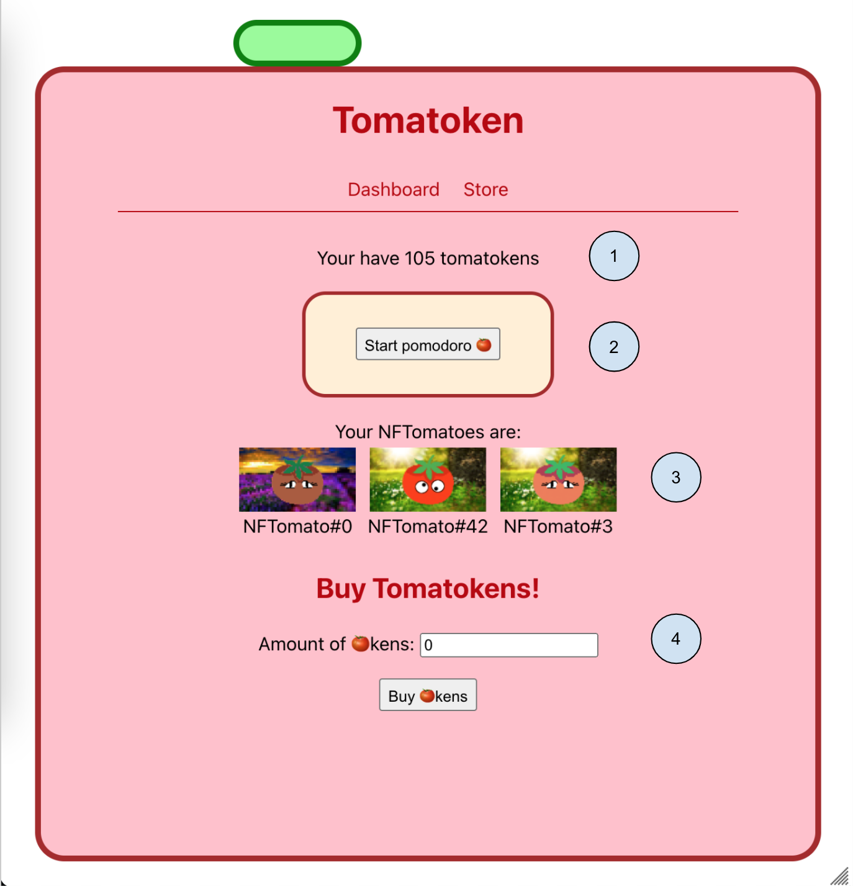

# Tomatoken

This is a very complete example of several blockchain technologies applications. In this project I create the Tomatoken, a token that will be used to reward users for successfully finishing pomodoros on the site. With Tomatokens they can buy the NFTomatoes that we mint on creation of the contract. The user can buy Tomatokens too using Etherium, but only a maximum amount per day.

## What can you do in Tomatoken

The application is divided in 2 screens: **Dashboard** and **Store**

**Dashboard**
The dashboard in the main screen. There you can see the ammount of Tomatokens you have (1), the pomodoro timer (2), the NFTomatoes you have (3), and the Tomatoken buy functionality (4).



When clicking "Start Pomodoro" a new pomodoro starts. Take into consideration that the pomodoro duration is set to 5 seconds for the sake of demoing the functionality, but the pomodoro technique sets it to 25 minutes by default (check the [pomodoro technique](https://francescocirillo.com/pages/pomodoro-technique) for more information).

After the pomodoro is finished, the user will be prompted with Metamask asking to sign a transaction. If the user signs it, one tomatoken will be granted to his/her account.

When the user inputs an amount of tomatokens to buy, the amount of wei it will cost will appear autocalculated in the screen. After clicking the buy button, Metamask will ask for confirmation of the transaction.

**Store**
The store is where the NFTomatoes are bought. You can buy the NFTomatoes at a fixed price of 1 ETH (plus gas fees). Clicking on one of the multiple "buy" buttons will make Metamask to popup asking for the confirmation of the transaction. After the confirmation is done, that NFTomato will disappear from the Store and will appear in the "Your NFTomatoes" section in the Dashboard (number 3 in the image).

# The Technical Stuff

## NFTs generation

To generate the NFTomatoes, we use the generator found here: https://github.com/NotLuksus/nft-art-generator

The source of the NFTs are in the `nft-sources` folder, separated by layers (background, body, eyes). This generator creates the image files and the json metadata files in the `output` folder

The commands for installing the generator and how to use it can be found in the generator readme file.

## NFTs upload

We upload the NFTs to IPFS using the Web3.Storage API. For that you need to go to https://web3.storage/ and create and account. Then create an API for this project and, after generated the NFTomatoes in the `output` folder, run this command:

```
node nft-upload.js --token=<YOUR_API_TOKEN>
```

NOTE: you will need to put `"type": "module"` in the `package.json` file for this to work, and remove it after this step is done.

It will upload the files into IPFS and give you a CID.

Each NFTomato image will be located in `https://[CID].ipfs.dweb.link/output/[0 based index of the NFTomato].png`
Each NFTomato json metadata file will be located in `https://[CID].ipfs.dweb.link/output/metadata/[0 based index of the NFTomato]` (without the json extension)

## Setting up the contract

Once you have the CID of the metadata, you have to edit the constructor of the contract with the url `https://[CID].ipfs.dweb.link/metadata/{id}` (without the json extension) using the CID given in the last step. Leave the `{id}` part of the url as is.
